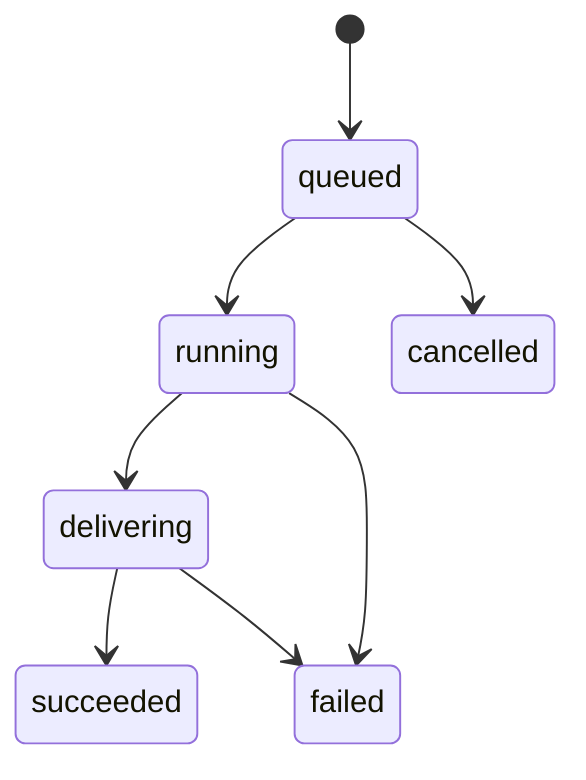

Yir's Standard REST surface exposes six public states: `queued`, `running`, `delivering`, `succeeded`, `failed`, and `cancelled`. Internal orchestration states and Provider response shapes are not public Job states.

:::warning
A slow request, transport timeout, or temporarily unknown provider outcome is not proof of failure. Continue querying the same task until Yir returns a terminal fact or your application deadline expires.
:::

<Panel title="Result retention">
  A v1 result is retained until 7 days after Job creation; existing results may expire earlier. While retained, `result.availability` is `available` and `result.files` contains download links. At expiry, the Job remains `succeeded` but returns `result.availability: "expired"` without files. Expiry does not itself confirm physical deletion. Summary logs are available until day 90, after which Job queries return not found. Independent accounting records remain. Persist results you need; Yir is not a permanent asset library.
</Panel>

## Stop requests and local timeouts

Request a remote stop with `POST /v1/jobs/{id}/cancel`. Before execution authorization, the Job can become `cancelled`. After authorization, `cancellation.status: "stop_requested"` means later attempts are stopped; it does not mean the running attempt has failed. Display “Stop requested” and continue querying. If the current attempt succeeds, Yir still delivers the result and settles its charge.

An AbortSignal, context deadline, disconnected browser, or local polling deadline does not send a remote cancellation. Keep the Job ID and resume querying later. Do not refund credits merely because your local wait ended.

## Terminal customer billing

For the new contract under integration, the terminal Job and its customer billing settle together. Successful delivery charges the winning attempt once and releases the unused hold. Final failure or cancellation releases the hold with zero customer charge; there is no second customer-billing wait.

A temporarily unknown upstream outcome remains active. If Yir ultimately closes a long-unknown attempt as a failed Job, customer billing stays final at zero; late upstream costs are absorbed by Yir and do not reopen the customer bill. This differs from a user's stop request while an attempt is still active.

Applications must process the same terminal fact idempotently whether it arrives through polling or a webhook. In Pilio, undelivered slots refund their original frozen credits once. Save delivered files before their retention expires. See [billing](/docs/concepts/billing).
