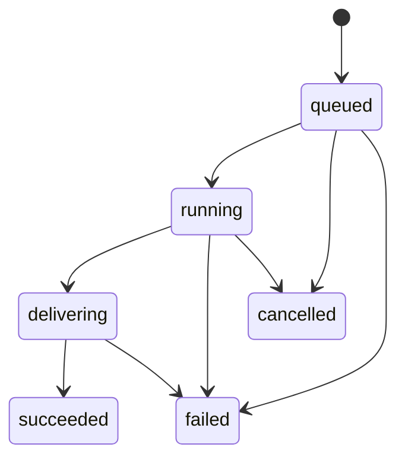

Every generation request creates one **Job**. The Job keeps the same ID from submission to its final result, even when Yir tries more than one provider channel behind the scenes.

## States

| Status | Meaning | Terminal |
| --- | --- | --- |
| `queued` | Accepted and waiting to start. | No |
| `running` | A provider attempt is in progress. Fallback attempts also happen in this state. | No |
| `delivering` | The provider returned a result; Yir is copying it to its own storage. | No |
| `succeeded` | The result is delivered and available under `result`. | Yes |
| `failed` | No attempt produced a deliverable result. See `error.code`. | Yes |
| `cancelled` | Cancelled before any provider submission started, or while Yir was confirming an unknown attempt outcome. | Yes |

```mermaid
stateDiagram-v2
  [*] --> queued
  queued --> running
  queued --> cancelled
  queued --> failed
  running --> delivering
  running --> failed
  running --> cancelled
  delivering --> succeeded
  delivering --> failed
```

These six states are the whole public contract. Provider-specific states and internal orchestration steps are never exposed.

## Polling

Use two endpoints:

- `GET /v1/jobs/{id}/status` returns a small summary (`id`, `status`, `error`, optional `cancellation`). Use it for repeated polling.
- `GET /v1/jobs/{id}` returns the complete Job, including `parameters`, `result`, `billing`, `usage`, `final_provider`, `urls`, and `parameter_notices`. Read it once the status is terminal. `parameters` echoes the normalized parameters the Job runs with, in the same shape as the quote echo, so you can check the delivered result against what was charged.

### Long polling

Add `wait=<seconds>` to hold the status request open: `GET /v1/jobs/{id}/status?wait=20`. A terminal Job answers at once. Otherwise Yir answers as soon as the status or cancellation state changes, or when the wait ends, with the current summary. You see the result about a second after Yir records it, without a Webhook and without frequent requests. `wait` is a whole number of seconds; values above 30 are treated as 30. Keep your HTTP timeout longer than the wait, and send the next request right after each answer until the Job is terminal.

The SDKs long-poll by default from TypeScript 0.7.0 and Go 0.8.0 (20-second hold).

Without `wait`, the recommended pacing is every 5 seconds for the first 30 seconds, every 10 seconds until about 90 seconds, then every 20 seconds. Always set an overall deadline in your application.

:::warning
A slow Job, a request timeout, or a provider that has not answered yet is **not** a failure. Keep querying the same Job ID. Do not submit a replacement request.
:::

Stopping your local polling (a timeout, an `AbortSignal`, a cancelled context, a closed browser tab) only stops waiting. It does not cancel the Job, and it does not mean the Job failed. Save the Job ID and resume later.

To avoid polling entirely, set `webhook_url` and receive the terminal Job by [Webhook](/docs/production/webhooks).

## Cancellation

Request cancellation with `POST /v1/jobs/{id}/cancel`. The effect depends on how far the Job has progressed:

- **Before any provider submission**, the Job becomes `cancelled` immediately and nothing is charged.
- **While Yir is confirming an unknown attempt outcome**, the Job becomes `cancelled` immediately. That attempt is not charged; earlier attempts the channel billed still are.
- **After a provider submission**, the response carries `cancellation.status: "stop_requested"`. Yir starts no further fallback attempts, but the current attempt keeps running. If it succeeds, the result is delivered and charged; if it fails, the Job ends as `failed` and is charged only what the channel billed for that attempt.

Show "Stop requested" in your UI in the second case and keep polling. Cancelling a Job that is already `succeeded` or `failed` returns `409 YIR_JOB_NOT_CANCELLABLE`. Repeating a cancel request is safe. If a cancel request fails or times out, the cancellation may already have taken effect: query the Job to see its current `status` and `cancellation`.

## Unknown outcomes

Occasionally a provider does not confirm whether an attempt succeeded. Yir keeps the Job active while it reconciles. If the outcome stays unknown for too long, Yir closes the Job as `failed` with `YIR_OUTCOME_TIMEOUT` and does not charge that attempt; earlier attempts the channel billed are still charged. A result that arrives later does not reopen or charge the Job.

Every Job also has a maximum run time: 30 minutes for images and 90 minutes for videos, counted from creation. A Job still unfinished then closes as `failed` with `YIR_JOB_TIMEOUT`, charged only for attempts with a confirmed channel bill.

## Results and retention

| What | Available until |
| --- | --- |
| Result files | 7 days after the Job was created (can be earlier for some results) |
| Individual result URL | `result.files[].expires_at`, often sooner than the file itself |
| Job record and summary log | 90 days after creation; afterwards queries return `404` |

While a result is kept, `result.availability` is `available` and `result.files` lists signed download URLs. If a URL has expired, query the Job again for a fresh one. When the retention window ends, the Job stays `succeeded` but `result.availability` becomes `expired` and no files are returned.

Yir is not an asset library. Copy every result you need to your own storage as soon as the Job succeeds.

A successful Job can carry `result.warnings: ["additional_results_unavailable"]` when an optional extra output (for example a video's last frame) could not be delivered. The Job is still successful and is charged normally.

### Content safety

A successful result can carry `result.content_safety`, which tells you whether the delivered output passed an NSFW check and who ran it:

| Value | Meaning |
| --- | --- |
| `{"status": "passed", "checked_by": "provider"}` | The upstream provider enforces content moderation on this route. |
| `{"status": "passed", "checked_by": "yir"}` | The provider has no reliable moderation, so Yir checked the output itself before delivery. |
| `{"status": "unchecked"}` | No check could be applied to this output. |

Before a Job with reference images is sent to a channel, Yir checks the prompt and those images once for explicit sexual content and content involving minors. If the check blocks them, the Job fails with `YIR_CONTENT_REJECTED` without being sent and is not charged; if the check is unavailable, Yir may try another channel, and otherwise the Job fails with `YIR_TEMPORARILY_UNAVAILABLE` (retryable) without being sent and is not charged, so submit again later. When the status is `passed`, you can skip your own NSFW check on the result. When it is `unchecked`, or the field is absent (results delivered before the field existed), apply your own policy. Output that fails a check is never delivered: the Job ends as `failed` with [`YIR_CONTENT_REJECTED`](/docs/production/error-codes), and is charged only if the provider had already billed the generation. Webhooks carry the same `result` object.

## Applying terminal results once

The same terminal Job can reach you twice: once from polling and once from a Webhook, or from a Webhook retry. Make your business actions (saving files, updating credits, marking orders complete) idempotent by Job ID so each Job is applied exactly once.
