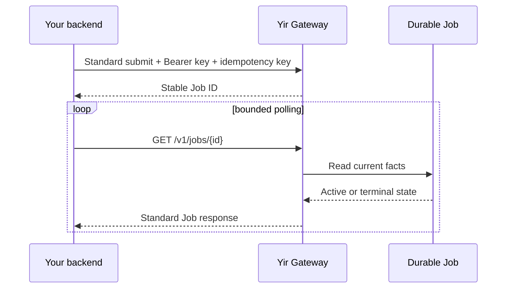

<Badge variant="success">Recommended</Badge>

Yir v1 has one public execution contract: the Standard API. Provider-specific request shapes and credentials stay behind Yir's certified routing and adapter boundary.

<CardGroup cols={3}>
  <Card title="Authenticate safely" icon="key-round" href="/docs/getting-started/authentication">
    Keep the Yir API key on the server and send it only as a Bearer credential.
  </Card>
  <Card title="Track one request" icon="fingerprint" href="#submission-contract">
    Persist the idempotency key and Job ID before polling.
  </Card>
  <Card title="Recover safely" icon="refresh-cw" href="#polling-and-recovery">
    Retry queries without turning a timeout into another generation request.
  </Card>
</CardGroup>

## Submission contract

<Steps>
  <Step title="Create an idempotency key">
    Generate one opaque value for one logical generation request. Reuse it only when retrying the identical request.
  </Step>
  <Step title="Submit through the Standard API">
    Send a canonical model and task specification. Do not send an upstream Provider credential or Provider-shaped request.
  </Step>
  <Step title="Persist the returned Job ID">
    Store the response `id` with your local request record before starting background polling.
  </Step>
  <Step title="Poll to a terminal state">
    Use a bounded interval and an overall application deadline. Continue querying the same Job after transient transport failures.
  </Step>
</Steps>

:::warning
Never generate a fresh idempotency key merely because the submit response timed out. The original request may already have been accepted and may still create billing facts.
:::

### Request headers

<TypeTable
  type={{
    Authorization: {
      type: "string",
      required: true,
      description: "A Yir credential in the form Bearer $YIR_API_KEY.",
    },
    "Idempotency-Key": {
      type: "string",
      required: false,
      description: "Optional, recommended for production. Reuse one value for identical logical-request retries.",
    },
  }}
/>

### Submit from your backend

Follow the [quickstart](/docs/getting-started/quickstart) to quote and save the authorized request as `yir-submission.json`. Load the original key from the persisted business record; do not generate a new key or change the budget on retry. See [clients](/docs/guides/clients) for TypeScript and Go.

```bash
: "${YIR_API_KEY:?}"
: "${YIR_IDEMPOTENCY_KEY:?}"
curl --fail-with-body --silent --show-error --max-time 30 \
  --request POST \
  --url "https://gateway.yir.ai/v1/images/generations" \
  --header "Authorization: Bearer $YIR_API_KEY" \
  --header "Content-Type: application/json" \
  --header "Idempotency-Key: $YIR_IDEMPOTENCY_KEY" \
  --data-binary @yir-submission.json
```

<Panel title="Persist these facts together">
  Store the local request ID, the idempotency key, the Yir Job ID, the submitted routing override, and the last observed public status. Never store the API key beside the Job record.
</Panel>

<FileTree>

- generation request
  - local request ID
  - idempotency key
  - Yir Job ID
  - submitted routing override
  - last public status

</FileTree>

## Routing control

Use the optional `routing` object in the Standard request body. `only` is an unordered allowlist of 1–16 providers; selection and recovery stay within it. A single item supports targeted testing. `preference` and `fallback` remain available; `order` is no longer accepted. These controls cannot select credentials or bypass authentication, specification, billing, safety, or attempt limits.

```json
{
  "routing": {
    "preference": "cost",
    "only": ["kie", "apimart"],
    "fallback": true
  }
}
```



## Polling and recovery

| Situation | Safe client behavior |
| --- | --- |
| Query returns an active status | Wait with jitter, then query the same Job ID again. |
| Query request times out | Treat the outcome as unknown and retry the query. |
| Submit response times out | Retry the identical submit with the same idempotency key. |
| Terminal failure is returned | Stop polling and handle the stable public error. |
| Terminal success is returned | Persist the result before expiry, normally 7 days after Job creation; existing results may expire earlier. |

<Accordion>
  <AccordionItem title="How fast should I poll?" icon="timer">
    Start conservatively, add jitter, and enforce an overall deadline in your application. A polling timeout is not proof that generation failed.
  </AccordionItem>
  <AccordionItem title="Should I replace a slow task?" icon="circle-slash">
    No. Query the existing Job ID. A second submit is a second logical request unless it is an idempotent retry of identical data.
  </AccordionItem>
  <AccordionItem title="What may I include in support evidence?" icon="life-buoy">
    Include the Yir Job ID, Standard operation, approximate UTC time, HTTP status, public error code, and a safe key prefix. Never include the complete key, prompt, source media, or raw Provider response.
  </AccordionItem>
</Accordion>

:::success
Your integration is ready for a controlled test when it persists both identifiers, reuses the idempotency key for submit retries, polls the same Job ID, and never exposes the Yir API key to browser code.
:::

Browse the <Tooltip tip="Generated directly from the checked-in Standard OpenAPI document." headline="API reference" cta="Open reference" href="/docs/reference">reviewed Standard operations</Tooltip> when implementing request and response fields.


## Video requests

Submit video to `POST /v1/videos/generations`, then query the same Job resource. This example uses Standard video fields; execution depends on the current model specification, supply and balance.

```json
{
  "model": "bytedance/seedance-2.0",
  "input": {"type": "text", "prompt": "A paper boat crossing a rain-covered city street"},
  "parameters": {
    "duration": 5,
    "resolution": "720p",
    "aspect_ratio": "16:9",
    "generate_audio": false,
    "n": 1
  }
}
```

## Input files

Use an external HTTPS URL accepted by the model contract, or upload through the Files API first. Do not send Base64, Data URLs, or multipart request bodies to generation endpoints.

1. Send file metadata to `POST /v1/files`, with optional `upload_mode`. Current modes are `auto | multipart`; automatic mode also returns a multipart plan.
2. Upload each part to its returned URL and retain its part number and ETag.
3. Submit the part numbers and ETags to `POST /v1/files/{id}/complete`. Only ready files may be used for generation.
4. Use the ready file ID in the model-supported `input.references` array, for example `{ "role": "reference_image", "file_id": "file_..." }`. Choose the role for image, frame, or multimodal input and provide exactly one of `url` or `file_id`. A relative `url` from Files is for authenticated content reads, not an external HTTPS reference. Send Bearer authentication only to the Gateway content endpoint, never its redirect target.

Files are temporary, and querying their state does not extend retention. Invalid batch metadata rejects the whole batch. Consult the [API reference](/docs/reference) for counts, sizes, media types and response fields instead of using a Provider-specific upload protocol.

## User callbacks

Set `webhook_url` on a generation request to receive the terminal Yir Job, rather than a raw Provider response. Verify `Yir-Webhook-Signature` with the independent Webhook Signing Secret, not your Yir API key.

Compute HMAC-SHA256 over `Yir-Webhook-Timestamp + "." + Yir-Webhook-Id + "." + raw_request_body`, encode it as Base64 and compare it with the `v1=` signature value in constant time. Check the timestamp window and signature before parsing JSON. Deduplicate by event ID and return 2xx after successful handling. Keep GET Job polling available to recover from delayed or missing callbacks.

Save any results you need before their retention window ends. Do not log callback signatures, source file URLs or secrets.
