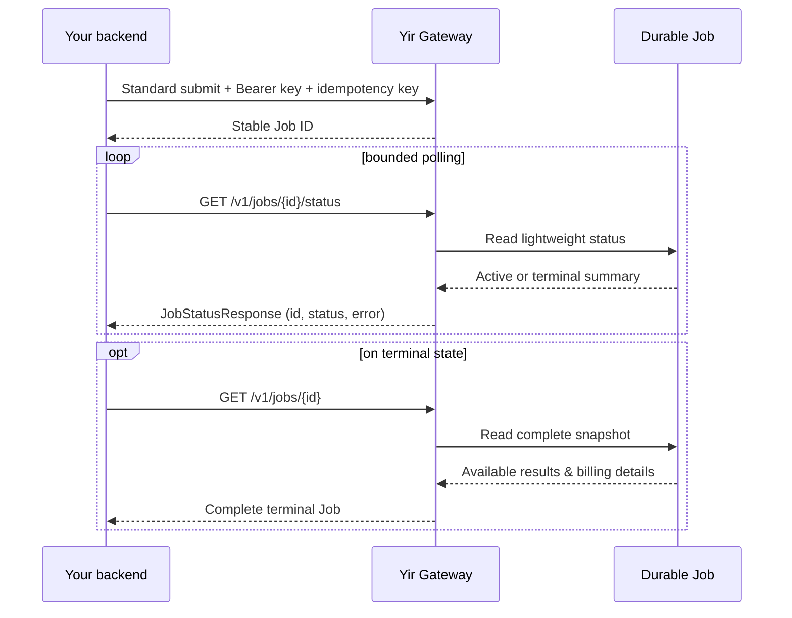

<Badge variant="success">Recommended</Badge>

Yir v1 has one public execution contract: the Standard API. Provider-specific request shapes and credentials stay behind Yir's certified routing and adapter boundary.

<CardGroup cols={3}>
  <Card title="Authenticate safely" icon="key-round" href="/docs/getting-started/authentication">
    Keep the Yir API key on the server and send it only as a Bearer credential.
  </Card>
  <Card title="Track one request" icon="fingerprint" href="#submission-contract">
    Persist the idempotency key and Job ID before polling.
  </Card>
  <Card title="Recover safely" icon="refresh-cw" href="#polling-and-recovery">
    Retry queries without turning a timeout into another generation request.
  </Card>
</CardGroup>

## Submission contract

<Steps>
  <Step title="Create an idempotency key">
    Generate one opaque value for one logical generation request. Reuse it only when retrying the identical request.
  </Step>
  <Step title="Submit through the Standard API">
    Send a canonical model and task specification. Do not send an upstream Provider credential or Provider-shaped request.
  </Step>
  <Step title="Persist the returned Job ID">
    Store the response `id` with your local request record before starting background polling.
  </Step>
  <Step title="Poll status to a terminal state">
    Poll `GET /v1/jobs/{id}/status` with a bounded interval and an overall deadline. When a terminal state is reached, fetch the complete Job via `GET /v1/jobs/{id}` for available results and billing details.
  </Step>
</Steps>

:::warning
Never generate a fresh idempotency key merely because the submit response timed out. The original request may already have been accepted and may still create billing facts.
:::

### Request headers

<TypeTable
  type={{
    Authorization: {
      type: "string",
      required: true,
      description: "A Yir credential in the form Bearer $YIR_API_KEY.",
    },
    "Idempotency-Key": {
      type: "string",
      required: false,
      description: "Optional, recommended for production. Reuse one value for identical logical-request retries.",
    },
  }}
/>

### Submit from your backend

Follow the [quickstart](/docs/getting-started/quickstart) to quote and save the authorized request as `yir-submission.json`. Load the original key from the persisted business record; do not generate a new key or change the budget on retry. See [clients](/docs/guides/clients) for TypeScript and Go.

```bash
: "${YIR_API_KEY:?}"
: "${YIR_IDEMPOTENCY_KEY:?}"
curl --fail-with-body --silent --show-error --max-time 30 \
  --request POST \
  --url "https://gateway.yir.ai/v1/images/generations" \
  --header "Authorization: Bearer $YIR_API_KEY" \
  --header "Content-Type: application/json" \
  --header "Idempotency-Key: $YIR_IDEMPOTENCY_KEY" \
  --data-binary @yir-submission.json
```

<Panel title="Persist these facts together">
  Store the local request ID, the idempotency key, the Yir Job ID, the submitted routing override, and the last observed public status. Never store the API key beside the Job record.
</Panel>

<FileTree>

- generation request
  - local request ID
  - idempotency key
  - Yir Job ID
  - submitted routing override
  - last public status

</FileTree>

## Routing control

Use the optional `routing` object in the Standard request body. `only` is an unordered allowlist of 1–16 providers; selection and recovery stay within it. A single item supports targeted testing. `preference` and `fallback` remain available; `order` is no longer accepted. These controls cannot select credentials or bypass authentication, specification, billing, safety, or attempt limits.

```json
{
  "routing": {
    "preference": "cost",
    "only": ["kie", "apimart"],
    "fallback": true
  }
}
```


```mermaid
sequenceDiagram
  participant App as Your backend
  participant Yir as Yir Gateway
  participant Job as Durable Job
  App->>Yir: Standard submit + Bearer key + idempotency key
  Yir-->>App: Stable Job ID
  loop bounded polling
    App->>Yir: GET /v1/jobs/{id}/status
    Yir->>Job: Read lightweight status
    Job-->>Yir: Active or terminal summary
    Yir-->>App: JobStatusResponse (id, status, error)
  end
  opt on terminal state
    App->>Yir: GET /v1/jobs/{id}
    Yir->>Job: Read complete snapshot
    Job-->>Yir: Available results & billing details
    Yir-->>App: Complete terminal Job
  end
```

## Polling and recovery

Ordinary polling queries `GET /v1/jobs/{id}/status`, which returns a lightweight status summary (`id`, `status`, `error`, and optional `cancellation`). The six public states remain unchanged. Because the status summary is not the full job detail, reaching a terminal state (`succeeded`, `failed`, or `cancelled`) prompts a follow-up `GET /v1/jobs/{id}` query to obtain complete result files and billing details.

| Situation | Safe client behavior |
| --- | --- |
| Status query returns an active status (`queued`, `running`, `delivering`) | Wait with interval jitter, then query `GET /v1/jobs/{id}/status` again. |
| Status query request times out | Treat the outcome as unknown and retry the status query. |
| Submit response times out | Retry the identical submit with the same idempotency key. |
| Status query returns terminal `failed` | Stop polling, fetch `GET /v1/jobs/{id}` for stable error and billing details, and handle the error. |
| Status query returns terminal `cancelled` | Stop polling, fetch `GET /v1/jobs/{id}` for cancellation facts and billing details (note that `error` may be `null`). |
| Status query returns terminal `succeeded` | Fetch `GET /v1/jobs/{id}` for delivered result files and billing details, and persist files before expiry (normally 7 days). |
| Terminal detail query (`GET /v1/jobs/{id}`) fails or times out | Retry only the detail query for the same Job ID; do not submit a new job and do not settle from a status summary. For 401, 403, or 404, resolve credentials, resource ownership, or retention window expiry first rather than retrying indefinitely. |

<Accordion>
  <AccordionItem title="How fast should I poll?" icon="timer">
    Use bounded polling with explicit intervals, jitter, and an application-level overall deadline. A polling timeout or local abort only halts local waiting; it does not send a remote cancel and does not authorize a new submission.
  </AccordionItem>
  <AccordionItem title="Should I replace a slow task?" icon="circle-slash">
    No. Query the existing Job ID. A second submit is a second logical request unless it is an idempotent retry of identical data.
  </AccordionItem>
  <AccordionItem title="What may I include in support evidence?" icon="life-buoy">
    Include the Yir Job ID, Standard operation, approximate UTC time, HTTP status, public error code, and a safe key prefix. Never include the complete key, prompt, source media, or raw Provider response.
  </AccordionItem>
</Accordion>

:::success
Your integration is ready for a controlled test when it persists both identifiers, reuses the idempotency key for submit retries, polls the same Job ID, and never exposes the Yir API key to browser code.
:::

Browse the <Tooltip tip="Generated directly from the checked-in Standard OpenAPI document." headline="API reference" cta="Open reference" href="/docs/reference">reviewed Standard operations</Tooltip> when implementing request and response fields.


## Video requests

Submit video to `POST /v1/videos/generations`, then query the same Job resource. This example uses Standard video fields; execution depends on the current model specification, supply and balance.

```json
{
  "model": "bytedance/seedance-2.0",
  "input": {"type": "text", "prompt": "A paper boat crossing a rain-covered city street"},
  "parameters": {
    "duration": 5,
    "resolution": "720p",
    "aspect_ratio": "16:9",
    "generate_audio": false,
    "n": 1
  }
}
```

## Input files

Use an external HTTPS URL accepted by the model contract, or upload through the Files API first. Do not send Base64, Data URLs, or multipart request bodies to generation endpoints.

1. Send file metadata to `POST /v1/files`, with optional `upload_mode`. Current modes are `auto | multipart`; automatic mode also returns a multipart plan.
2. Upload each part to its returned URL and retain its part number and ETag.
3. Submit the part numbers and ETags to `POST /v1/files/{id}/complete`. Only ready files may be used for generation.
4. Use the ready file ID in the model-supported `input.references` array, for example `{ "role": "reference_image", "file_id": "file_..." }`. Choose the role for image, frame, or multimodal input and provide exactly one of `url` or `file_id`. A relative `url` from Files is for authenticated content reads, not an external HTTPS reference. Send Bearer authentication only to the Gateway content endpoint, never its redirect target.

Files are temporary, and querying their state does not extend retention. Invalid batch metadata rejects the whole batch. Consult the [API reference](/docs/reference) for counts, sizes, media types and response fields instead of using a Provider-specific upload protocol.

## User callbacks

Set `webhook_url` on a generation request to receive the terminal Yir Job, rather than a raw Provider response. Unlike lightweight polling summaries, webhooks always deliver the complete terminal Job directly, containing available result files on success along with billing details. Verify `Yir-Webhook-Signature` with the independent Webhook Signing Secret, not your Yir API key.

Compute HMAC-SHA256 over `Yir-Webhook-Timestamp + "." + Yir-Webhook-Id + "." + raw_request_body`, encode it as Base64 and compare it with the `v1=` signature value in constant time. Always check the timestamp window and verify signatures over original raw request bytes before parsing JSON.

The `Yir-Webhook-Event` header identifies `job.succeeded`, `job.failed`, or `job.cancelled`. The body is the terminal Job itself, with the same billing projection as `GET /v1/jobs/{id}`. Read `billing.total_charged_by_yir` for the final customer charge and `billing.currency` for its currency (`USD`). Amounts are decimal strings; use decimal arithmetic if your application converts them into credits. `billing.max_cost` is the authorization limit, not the charge.

For new Jobs, terminal notification follows settlement. Successful Jobs are charged only after result delivery; failed or cancelled Jobs release the reservation with no customer charge. Retries notify you of the existing outcome and do not charge the Job again. Keep the stable event ID as your deduplication key: delivery timestamps and signatures change, and temporary result URLs may be refreshed between deliveries.

### Signing secrets and delivery records

In Console, open **Webhooks** to reveal or rotate your account's signing secret and inspect delivery records. Accounts with a password must confirm it before revealing or rotating the secret. After rotation, update your receiver to verify subsequent deliveries with the new secret. Keep the secret on your server, separate from your Yir API key.

Continue specifying `webhook_url` on each generation request; Console does not register a default endpoint. Delivery records show the receiving origin, event ID, status, and cumulative attempt count. The origin omits the path, query, and credentials; it is not the complete callback URL.

For a delivered or failed record, **Redeliver** queues the existing event for background delivery. A queued response does not mean the receiver has accepted it. Pending records cannot be queued again. Redelivery keeps the event ID and cumulative attempt count, does not reset the automatic retry budget, and never resubmits or charges the Job again. Refresh the list to inspect the delivery outcome.

### Receiver idempotency

Implement deduplication and idempotency on two distinct levels:
1. **Webhook event deduplication**: Deduplicate incoming deliveries using the stable `Yir-Webhook-Id` header to protect against network retries or replays, and acknowledge with 2xx once handled.
2. **Business terminal idempotency by Job ID**: Because polling queries (`GET /v1/jobs/{id}`) and webhook deliveries may race concurrently, business actions (saving assets, debiting or refunding credits, finalizing billing) must be idempotent keyed by `job.id` so that settlement is applied exactly once.

Delayed or lost webhook deliveries can be recovered within the retention window by polling `GET /v1/jobs/{id}`. Save any results you need before their retention window ends. Do not log callback signatures, source file URLs or secrets.
