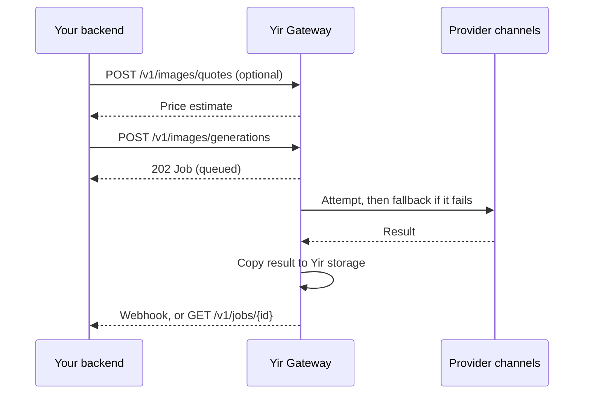

<Badge variant="warning">Developer preview</Badge>

Yir is a unified asynchronous AI gateway for image and video generation. You send one Standard API request; Yir selects an eligible provider channel, tries another channel if an attempt fails (within your `max_cost`, when set), and gives you one durable Job to follow until the result is delivered.

<CardGroup cols={2}>
  <Card title="Quickstart" href="/docs/getting-started/quickstart" icon="rocket">
    Generate your first image with cURL in a few minutes.
  </Card>
  <Card title="Choose an integration" href="/docs/integrations" icon="plug">
    REST, SDKs, the Vercel AI SDK, or OpenAI compatibility for your stack.
  </Card>
  <Card title="Production checklist" href="/docs/production/checklist" icon="shield-check">
    Idempotency, polling, Webhooks, cost control, and error handling.
  </Card>
  <Card title="API reference" href="/docs/reference" icon="braces">
    Every public operation, generated from the reviewed OpenAPI contract.
  </Card>
</CardGroup>

## How a request flows

- **One Job per request.** Fallback attempts happen inside the Job. You never resubmit to recover from a provider failure.
- **Pay the channel's actual bill.** Every attempt the channel billed is charged after your discount, even if it failed; attempts the channel never billed cost nothing, and Yir absorbs its own delivery failures and timeouts. See [quotes and billing](/docs/concepts/billing).
- **No provider credentials.** Authenticate with your Yir API Key only. See [authentication](/docs/getting-started/authentication).

## Find by goal

| Goal | Start with | Then |
| --- | --- | --- |
| Integrate for the first time | [Quickstart](/docs/getting-started/quickstart) | [Choose an integration](/docs/integrations) · [Quotes and billing](/docs/concepts/billing) |
| Migrate from OpenAI Images, Sora, or new-api | [OpenAI compatibility and new-api](/docs/integrations/openai-compatibility) | [Differences from official APIs](/docs/models/official-api-differences) |
| Generate images or videos | [Image generation](/docs/guides/image-generation) · [Video generation](/docs/guides/video-generation) | [Input files](/docs/guides/input-files) |
| Look up models and parameters | [Model catalog and parameters](/docs/models) | [Model marketplace](https://yir.ai/models) |
| Control cost and channels | [Quotes and billing](/docs/concepts/billing) | [Routing and fallback](/docs/concepts/routing) |
| Go to production | [Production checklist](/docs/production/checklist) | [Webhooks](/docs/production/webhooks) · [Job lifecycle](/docs/concepts/task-lifecycle) |
| Handle an error | [Error codes](/docs/production/error-codes) | [Troubleshooting](/docs/production/troubleshooting) |
