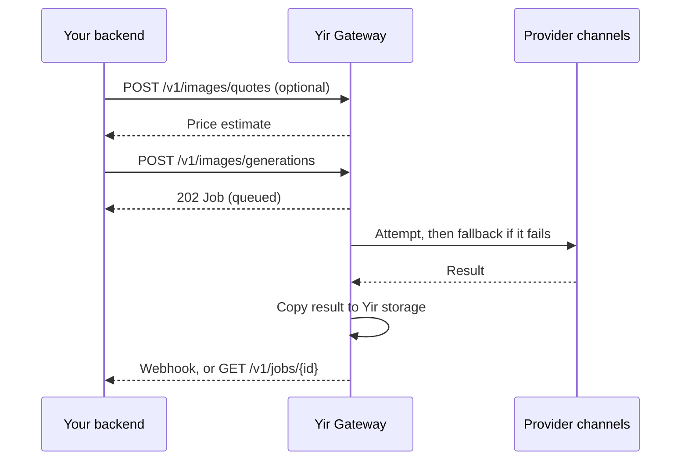

<Badge variant="warning">Developer preview</Badge>

Yir is a unified asynchronous AI gateway for image and video generation. You send one Standard API request; Yir selects an eligible provider channel, tries another channel if an attempt fails (within your `max_cost`, when set), and gives you one durable Job to follow until the result is delivered.

<CardGroup cols={2}>
  <Card title="Quickstart" href="/docs/getting-started/quickstart" icon="rocket">
    Generate your first image with cURL in a few minutes.
  </Card>
  <Card title="Production checklist" href="/docs/guides/production-integration" icon="shield-check">
    Idempotency, polling, Webhooks, cost control, and error handling.
  </Card>
  <Card title="SDKs" href="/docs/guides/clients" icon="package">
    TypeScript and Go clients for quotes, jobs, files, and Webhooks.
  </Card>
  <Card title="API reference" href="/docs/reference" icon="braces">
    Every public operation, generated from the reviewed OpenAPI contract.
  </Card>
</CardGroup>

## How a request flows

- **One Job per request.** Fallback attempts happen inside the Job. You never resubmit to recover from a provider failure.
- **Pay for delivered results only.** Failed and cancelled Jobs are not charged. See [quotes and billing](/docs/concepts/billing).
- **No provider credentials.** Authenticate with your Yir API key only. See [authentication](/docs/getting-started/authentication).

## Find what you need

| Goal | Page |
| --- | --- |
| Generate images or videos | [Images](/docs/guides/image-generation) · [Videos](/docs/guides/video-generation) |
| Use your own reference media | [Input files](/docs/guides/input-files) |
| Discover models and their parameters | [Models and parameters](/docs/guides/models) |
| Receive results by callback | [Webhooks](/docs/guides/webhooks) |
| Control which channels run | [Routing](/docs/concepts/routing) |
| Handle an error | [Error codes](/docs/support/error-codes) |
