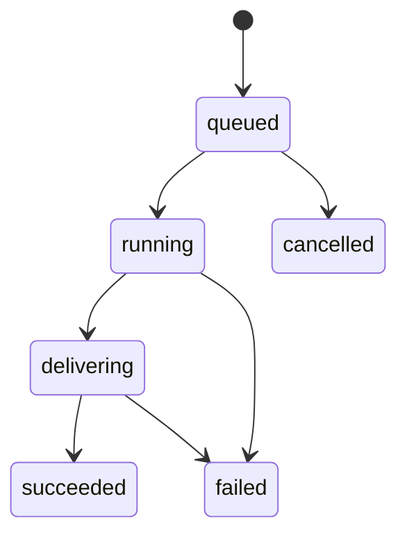

Yir Standard REST 只公开六种状态：`queued`、`running`、`delivering`、`succeeded`、`failed` 和 `cancelled`。内部编排状态和 Provider 响应结构都不是公开 Job 状态。

```mermaid
stateDiagram-v2
  [*] --> queued
  queued --> running
  running --> delivering
  delivering --> succeeded
  queued --> cancelled
  running --> failed
  delivering --> failed
```

:::warning
任务变慢、网络超时或 Provider 结果暂时未知，都不等于任务失败。应继续查询同一任务，直到 Yir 返回终态事实或应用自己的总期限结束。
:::

<Panel title="结果保留">
  v1 结果保留至任务创建后第 7 天，已有结果可能更早到期。保留期内 `result.availability` 为 `available`，`result.files` 提供下载地址；到期后 Job 仍为 `succeeded`，但只返回 `result.availability: "expired"`，不再返回文件。“已过期”本身不代表已完成物理删除。摘要日志保留至第 90 天，此后任务查询返回不存在，独立账务记录继续保留。请在结果过期前保存所需内容；Yir 不是永久资产库。
</Panel>

## 状态轮询与终态详情

普通轮询使用轻量端点 `GET /v1/jobs/{id}/status`。它返回仅包含 `id`、`status`、`error` 以及可选 `cancellation` 的最小投影，无需加载 attempt 尝试列表、计费明细或生成结果资产。六种公开状态保持不变。

状态摘要并非完整任务详情。当状态进入终态（`succeeded`、`failed` 或 `cancelled`）时，客户端再调用 `GET /v1/jobs/{id}` 获取完整快照，以取得交付文件（`result`）、计费明细（`billing`）和用量指标（`usage`）。

与轮询摘要不同，Webhook 通知总是直接投递完整终态 Job 快照，成功时包含可用结果与计费明细。

## 停止请求与本地超时

通过 `POST /v1/jobs/{id}/cancel` 请求远端停止。执行授权前可以进入 `cancelled`；授权后返回 `cancellation.status: "stop_requested"`，表示停止后续尝试，不代表当前尝试已经失败。界面显示“已请求停止”并继续查询。当前尝试成功时仍交付结果并结算费用。

轮询等待应设置明确的间隔与应用总期限（有界等待）。AbortSignal、context 截止时间、浏览器断开或本地轮询截止仅停止本地等待，绝不会自动发送远端 `POST /v1/jobs/{id}/cancel`，也绝不能发起新的 Submit 提交。保留 Job ID，稍后恢复查询。不能仅因本地等待结束就判定失败或退积分。

## 终态客户费用

正在集成的新合同中，Job 终态与客户费用同时确定。成功交付只结算获胜尝试一次，并释放多余冻结金额；最终失败或取消释放全部冻结金额，客户费用为零，不需要再等待另一轮客户费用确认。

短暂无法确认的上游结果仍保持任务未终结。Yir 最终将长期不明任务关闭为失败后，客户零费用不再改变；迟到的上游成本由 Yir 内部承担，不重新扣客户费用。这与当前尝试仍在运行时的用户停止请求不同。

应用对轮询和 Webhook 收到的同一终态执行幂等处理。轮询查询（`GET /v1/jobs/{id}`）与 Webhook 回调可能并发到达产生竞态，业务系统必须以 Job ID 为键确保终态结算与积分变动仅执行一次。若 Webhook 回调延迟或丢失，在保留期内可通过主动查询 `GET /v1/jobs/{id}` 恢复终态。成功交付的文件应在留存到期前保存。详见[计费](/zh/docs/concepts/billing)。
