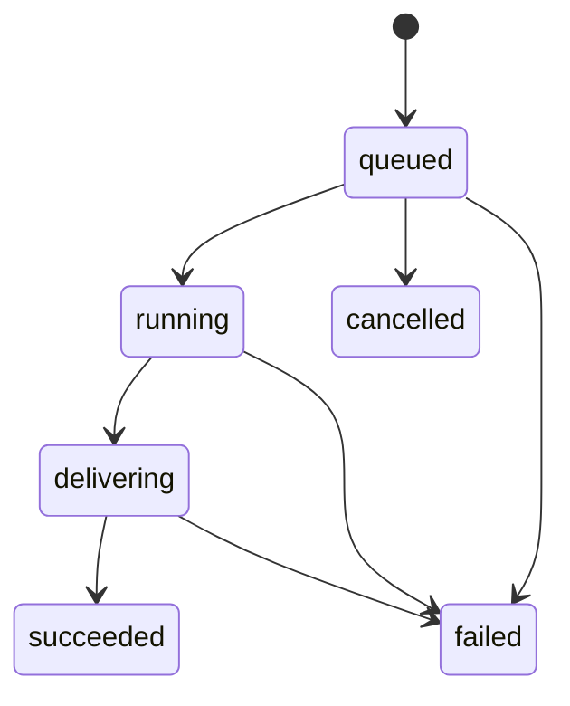

每个生成请求都会创建一个 **Job**。从提交到最终结果，Job ID 保持不变，即使 Yir 在内部尝试了多个供应渠道。

## 状态

| 状态 | 含义 | 终态 |
| --- | --- | --- |
| `queued` | 已接受，等待开始。 | 否 |
| `running` | 正在执行渠道尝试，切换渠道也发生在此状态。 | 否 |
| `delivering` | 渠道已返回结果，Yir 正在复制到自有存储。 | 否 |
| `succeeded` | 结果已交付，可在 `result` 中获取。 | 是 |
| `failed` | 没有任何尝试产出可交付结果，见 `error.code`。 | 是 |
| `cancelled` | 在向任何渠道提交之前被取消。 | 是 |

```mermaid
stateDiagram-v2
  [*] --> queued
  queued --> running
  queued --> cancelled
  queued --> failed
  running --> delivering
  running --> failed
  delivering --> succeeded
  delivering --> failed
```

这六个状态就是完整的公开合同。渠道特有状态和内部编排步骤不会对外暴露。

## 轮询

使用两个接口：

- `GET /v1/jobs/{id}/status` 返回精简摘要（`id`、`status`、`error`，以及可选的 `cancellation`），用于反复轮询。
- `GET /v1/jobs/{id}` 返回完整 Job，包括 `result`、`billing`、`usage` 和 `parameter_notices`，在状态进入终态后读取一次。

推荐节奏（SDK 默认相同）：前 30 秒每 5 秒一次，约 90 秒内每 10 秒一次，之后每 20 秒一次。应用侧务必设置总体截止时间。

:::warning
Job 慢、请求超时或渠道暂未答复，都**不代表**失败。继续查询同一个 Job ID，不要提交替代请求。
:::

停止本地轮询（超时、`AbortSignal`、取消 context、关闭浏览器标签页）只是停止等待，不会取消 Job，也不说明 Job 失败。保存 Job ID，稍后继续查询即可。

如不想轮询，可设置 `webhook_url`，通过 [Webhook](/zh/docs/guides/webhooks) 接收终态 Job。

## 取消

调用 `POST /v1/jobs/{id}/cancel` 请求取消，效果取决于 Job 的进展：

- **尚未向任何渠道提交**：Job 立即变为 `cancelled`，预留资金全部释放。
- **已向渠道提交**：响应带有 `cancellation.status: "stop_requested"`。Yir 不再发起后续切换尝试，但当前尝试会继续。若成功，结果照常交付并收费；若失败，Job 以 `failed` 结束且不收费。

第二种情况请在界面显示「已请求停止」并继续轮询。对已 `succeeded` 或 `failed` 的 Job 取消会返回 `409 YIR_JOB_NOT_CANCELLABLE`。重复发送取消请求是安全的。如果取消请求失败或超时，取消可能已经生效：请查询 Job 的 `status` 与 `cancellation` 确认当前状态。

## 结果未知

少数情况下渠道不会确认尝试是否成功。Yir 在核对期间保持 Job 为活动状态；如果长时间仍无法确认，Yir 以 `YIR_OUTCOME_TIMEOUT` 将 Job 关闭为 `failed`，不收取任何费用。之后才到达的结果不会重新打开该 Job，也不会收费。

## 结果与保留期

| 内容 | 可用期限 |
| --- | --- |
| 结果文件 | Job 创建后 7 天（部分结果可能更早过期） |
| 单个结果地址 | `result.files[].expires_at`，通常早于文件本身 |
| Job 记录与摘要日志 | 创建后 90 天，之后查询返回 `404` |

保留期内 `result.availability` 为 `available`，`result.files` 提供签名下载地址。地址过期后，重新查询 Job 即可获得新地址。保留期结束后，Job 仍为 `succeeded`，但 `result.availability` 变为 `expired`，不再返回文件。

Yir 不是素材库。Job 成功后请尽快把需要的结果复制到自己的存储。

当可选的附加输出（例如视频尾帧）未能交付时，成功的 Job 会带有 `result.warnings: ["additional_results_unavailable"]`。Job 仍然成功，按正常方式计费。

## 终态只处理一次

同一个终态 Job 可能两次到达：一次来自轮询，一次来自 Webhook，或来自 Webhook 重投。请按 Job ID 对业务动作（保存文件、更新积分、完成订单）做幂等，确保每个 Job 只处理一次。
