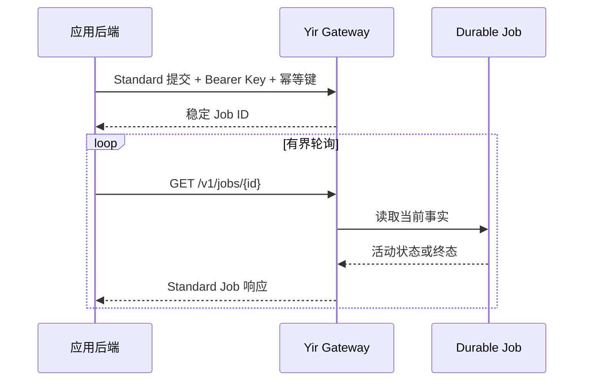

<Badge variant="success">推荐</Badge>

Yir v1 只有一个公开执行合同：Standard API。Provider 特有的请求结构和 Credential 始终位于 Yir 的认证路由与 Adapter 边界之后。

<CardGroup cols={3}>
  <Card title="安全认证" icon="key-round" href="/zh/docs/getting-started/authentication">
    Yir API Key 只保存在服务端，并且只作为 Bearer Credential 发送。
  </Card>
  <Card title="跟踪一个逻辑请求" icon="fingerprint" href="#提交合同">
    开始轮询前，先持久化幂等键和 Job ID。
  </Card>
  <Card title="安全恢复" icon="refresh-cw" href="#轮询与恢复">
    重试查询，不要把超时变成另一个生成请求。
  </Card>
</CardGroup>

## 提交合同

<Steps>
  <Step title="创建幂等键">
    一个逻辑生成请求只生成一个不透明值。只有重试完全相同的数据时才能复用。
  </Step>
  <Step title="通过 Standard API 提交">
    发送标准模型和任务规格。不要发送上游 Provider Credential 或 Provider 特有请求结构。
  </Step>
  <Step title="保存返回的 Job ID">
    在启动后台轮询前，把响应 `id` 与本地请求记录一起持久化。
  </Step>
  <Step title="轮询到终态">
    使用有界间隔和应用总期限；临时网络错误后继续查询同一个 Job。
  </Step>
</Steps>

:::warning
不要因为提交响应超时就生成新的幂等键。原始请求可能已经被接受，并且仍可能产生计费事实。
:::

### 请求 Header

<TypeTable
  type={{
    Authorization: {
      type: "string",
      required: true,
      description: "格式为 Bearer $YIR_API_KEY 的 Yir Credential。",
    },
    "Idempotency-Key": {
      type: "string",
      required: false,
      description: "可选，生产环境建议使用；相同逻辑请求的提交重试复用同一个值。",
    },
  }}
/>

### 从后端提交

先按[快速开始](/zh/docs/getting-started/quickstart)完成报价并保存授权请求为 `yir-submission.json`。从持久化业务记录读取原幂等键，不在重试时创建新键或修改预算。TypeScript 与 Go 接入见[客户端指南](/zh/docs/guides/clients)。

```bash
: "${YIR_API_KEY:?}"
: "${YIR_IDEMPOTENCY_KEY:?}"
curl --fail-with-body --silent --show-error --max-time 30 \
  --request POST \
  --url "https://gateway.yir.ai/v1/images/generations" \
  --header "Authorization: Bearer $YIR_API_KEY" \
  --header "Content-Type: application/json" \
  --header "Idempotency-Key: $YIR_IDEMPOTENCY_KEY" \
  --data-binary @yir-submission.json
```

<Panel title="一起保存这些事实">
  保存本地请求 ID、幂等键、Yir Job ID、已提交的 RoutingOverride 和最后一次公开状态。不要把 API Key 与 Job 记录保存在一起。
</Panel>

<FileTree>

- 生成请求
  - 本地请求 ID
  - 幂等键
  - Yir Job ID
  - 已提交的 RoutingOverride
  - 最后一次公开状态

</FileTree>

## 路由控制

在 Standard 请求体中使用可选的 `routing` 对象。`only` 是 1–16 个渠道的无序白名单，选择与恢复不得越出白名单；单元素白名单用于定点测试。保留 `preference` 与 `fallback`，不再接受 `order`。这些控制不能选择 Credential，也不能绕过认证、规格、计费、安全及 Attempt 上限。

```json
{
  "routing": {
    "preference": "cost",
    "only": ["kie", "apimart"],
    "fallback": true
  }
}
```



## 轮询与恢复

| 情况 | 安全处理方式 |
| --- | --- |
| 查询返回活动状态 | 加入抖动后，继续查询同一个 Job ID。 |
| 查询请求超时 | 把结果视为未知，并重试查询。 |
| 提交响应超时 | 使用相同幂等键和完全相同的数据重试提交。 |
| 返回终态失败 | 停止轮询，处理稳定的公开错误。 |
| 返回终态成功 | 在结果到期前保存，默认截止任务创建后第 7 天；已有结果可能更早到期。 |

<Accordion>
  <AccordionItem title="应该多快轮询？" icon="timer">
    从保守间隔开始，加入抖动，并在应用侧设置总期限。轮询超时不是任务失败事实。
  </AccordionItem>
  <AccordionItem title="Job 变慢时要不要重新提交？" icon="circle-slash">
    不要。继续查询现有 Job ID。除非是相同数据和相同幂等键的重试，否则会成为第二个逻辑请求。
  </AccordionItem>
  <AccordionItem title="支持工单可以提供什么？" icon="life-buoy">
    提供 Yir Job ID、Standard Operation、大致 UTC 时间、HTTP 状态、公开错误码和安全的 Key 前缀；不要提供完整 Key、Prompt、素材或 Provider 原始响应。
  </AccordionItem>
</Accordion>

:::success
当实现能够保存两个标识、正确重试提交、持续查询同一个 Job，并且不向浏览器暴露 API Key 时，就可以进行受控测试。
:::

实现请求和响应字段时，可查看<Tooltip tip="由仓库内 Standard OpenAPI 文档直接生成。" headline="API 参考" cta="打开参考" href="/zh/docs/reference">已经评审的 Standard Operations</Tooltip>。


## 视频请求

视频使用 `POST /v1/videos/generations`，随后仍查询同一个 Job 资源。以下示例使用 Standard 视频字段；是否可执行取决于当前模型规格、供应和余额。

```json
{
  "model": "bytedance/seedance-2.0",
  "input": {"type": "text", "prompt": "A paper boat crossing a rain-covered city street"},
  "parameters": {
    "duration": 5,
    "resolution": "720p",
    "aspect_ratio": "16:9",
    "generate_audio": false,
    "n": 1
  }
}
```

## 输入文件

可使用模型合同允许的外部 HTTPS URL，或先通过 Files API 上传输入。不要将 Base64、Data URL 或 multipart 请求体发给生成端点。

1. 向 `POST /v1/files` 发送 `files` 元数据和可选 `upload_mode`；当前模式为 `auto | multipart`，自动模式也返回分片计划。
2. 按返回的每个分片 URL 上传，保留分片编号与 ETag。
3. 调用 `POST /v1/files/{id}/complete`，提交分片编号与 ETag；只有 ready 文件才能进入生成请求。
4. 在模型支持的 `input.references` 数组中使用就绪文件的 `id`，例如 `{ "role": "reference_image", "file_id": "file_..." }`。角色随图片、首尾帧及多模态输入确定，每项只使用 `url` 或 `file_id` 之一。文件响应的相对 `url` 仅用于鉴权读取，不填入外部 HTTPS 引用字段；读取时只向 Gateway 内容入口发送 Bearer，不向其重定向目标转发 Yir Key。

文件短期保留，查询文件状态不会延长有效期。批量元数据非法时整批拒绝；数量、大小、媒体类型与响应字段查阅 [API 参考](/zh/docs/reference)，不要根据上游 Provider 的上传协议组装请求。

## 用户回调

可在生成请求中提供 `webhook_url`；它接收 Yir 终态 Job，不是 Provider 原始响应。使用独立 Webhook Signing Secret 验证 `Yir-Webhook-Signature`，不使用 Yir API Key。

对 `Yir-Webhook-Timestamp + "." + Yir-Webhook-Id + "." + raw_request_body` 计算 HMAC-SHA256，Base64 编码后与签名中的 `v1=` 值进行常量时间比较。先检查时间窗口和签名，再解析 JSON；按事件 ID 去重，成功处理返回 2xx。投递可能重复或延迟，仍保留 GET Job 查询以恢复漏回调。

结果地址会过期，及时保存需要长期保留的结果；回调签名、源文件地址和 Secret 不写入普通日志。
