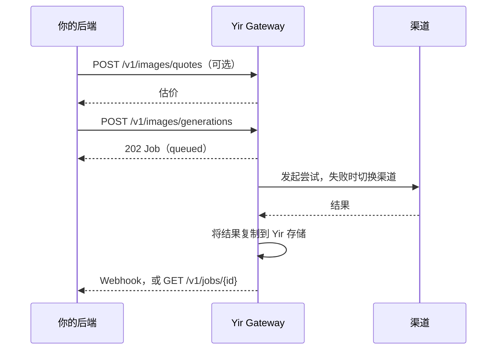

<Badge variant="warning">开发者预览</Badge>

用一个 Standard API 请求生成图片或视频。Yir 选择渠道发起尝试，失败时自动切换到其他渠道（设置了 `max_cost` 时不超出它），全程用同一个 Job 跟踪到结果交付。

<CardGroup cols={2}>
  <Card title="快速上手" href="/zh/docs/getting-started/quickstart" icon="rocket">
    几分钟内用 cURL 生成第一张图片。
  </Card>
  <Card title="选择接入方式" href="/zh/docs/integrations" icon="plug">
    REST、SDK、Vercel AI SDK 或 OpenAI 兼容，按现有技术栈选择。
  </Card>
  <Card title="模型目录与参数" href="/zh/docs/models" icon="image">
    全部可用模型、参数与渠道差异。
  </Card>
  <Card title="API 参考" href="/zh/docs/reference" icon="braces">
    由已审查的 OpenAPI 合同生成的全部公开接口。
  </Card>
</CardGroup>

## 一个请求的样子

```bash
curl https://gateway.yir.ai/v1/images/generations   --header "Authorization: Bearer $YIR_API_KEY"   --header "Content-Type: application/json"   --header "Idempotency-Key: my-first-job"   --data '{
    "model": "openai/gpt-image-2",
    "input": { "type": "text", "prompt": "云海之上一座安静的天文台" },
    "parameters": { "resolution": "1K", "aspect_ratio": "1:1", "n": 1 }
  }'
```

Yir 立即返回 `202` 和一个 `queued` 状态的 Job，之后用 Webhook 或 `GET /v1/jobs/{id}` 取结果。完整步骤见[快速上手](/zh/docs/getting-started/quickstart)。

## 请求如何流转



- **一个请求对应一个 Job。** 渠道切换在 Job 内部完成，渠道失败时无需重新提交。
- **按渠道实际账单付费。** 渠道计了费的每次尝试都按折扣后金额收取，失败的也一样；渠道没计费的尝试不收费，Yir 自身的交付失败与超时由 Yir 承担。见[报价与计费](/zh/docs/concepts/billing)。
- **无需上游凭据。** 只使用 Yir API Key 认证。见[身份认证](/zh/docs/getting-started/authentication)。

## 按目标查找

| 目标 | 先看 | 再看 |
| --- | --- | --- |
| 第一次接入 | [快速上手](/zh/docs/getting-started/quickstart) | [选择接入方式](/zh/docs/integrations) · [报价与计费](/zh/docs/concepts/billing) |
| 从 OpenAI Images、Sora 或 new-api 迁移 | [OpenAI 兼容与 new-api](/zh/docs/integrations/openai-compatibility) | [与官方 API 的差异](/zh/docs/models/official-api-differences) |
| 生成图片或视频 | [图片生成](/zh/docs/guides/image-generation) · [视频生成](/zh/docs/guides/video-generation) | [输入文件](/zh/docs/guides/input-files) |
| 查模型和参数 | [模型目录与参数](/zh/docs/models) | [模型市场](https://yir.ai/zh/models) |
| 控制费用和渠道 | [报价与计费](/zh/docs/concepts/billing) | [路由与渠道切换](/zh/docs/concepts/routing) |
| 准备上线 | [上线检查清单](/zh/docs/production/checklist) | [Webhook](/zh/docs/production/webhooks) · [Job 生命周期](/zh/docs/concepts/task-lifecycle) |
| 处理报错 | [错误码](/zh/docs/production/error-codes) | [故障排查](/zh/docs/production/troubleshooting) |
