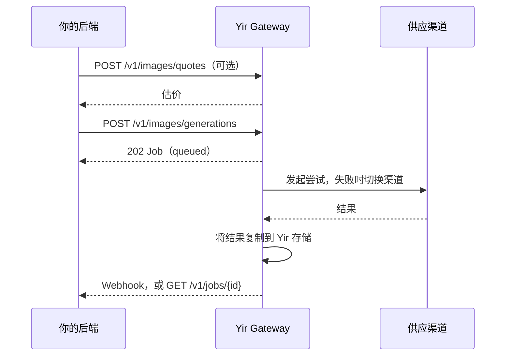

<Badge variant="warning">开发者预览</Badge>

Yir 是面向图片与视频生成的统一异步 AI 网关。你只需发送一个 Standard API 请求：Yir 会选择合适的供应渠道，某次尝试失败时切换到其他渠道（设置了 `max_cost` 时不超出它），并始终用同一个持久化 Job 跟踪到结果交付。

<CardGroup cols={2}>
  <Card title="快速上手" href="/zh/docs/getting-started/quickstart" icon="rocket">
    几分钟内用 cURL 生成第一张图片。
  </Card>
  <Card title="上线检查清单" href="/zh/docs/guides/production-integration" icon="shield-check">
    幂等、轮询、Webhook、费用控制与错误处理。
  </Card>
  <Card title="SDK" href="/zh/docs/guides/clients" icon="package">
    TypeScript 与 Go 客户端，覆盖报价、任务、文件与 Webhook。
  </Card>
  <Card title="API 参考" href="/zh/docs/reference" icon="braces">
    由已审查的 OpenAPI 合同生成的全部公开接口。
  </Card>
</CardGroup>

## 请求如何流转

- **一个请求对应一个 Job。** 渠道切换在 Job 内部完成，渠道失败时无需重新提交。
- **只为交付的结果付费。** 失败或已取消的 Job 不收费。见[报价与计费](/zh/docs/concepts/billing)。
- **无需上游凭据。** 只使用 Yir API Key 认证。见[身份认证](/zh/docs/getting-started/authentication)。

## 按需查阅

| 目标 | 页面 |
| --- | --- |
| 生成图片或视频 | [图片生成](/zh/docs/guides/image-generation) · [视频生成](/zh/docs/guides/video-generation) |
| 使用自己的参考素材 | [输入文件](/zh/docs/guides/input-files) |
| 查找模型及其参数 | [模型与参数](/zh/docs/guides/models) |
| 通过回调接收结果 | [Webhook](/zh/docs/guides/webhooks) |
| 控制执行渠道 | [路由](/zh/docs/concepts/routing) |
| 处理错误 | [错误码](/zh/docs/support/error-codes) |
